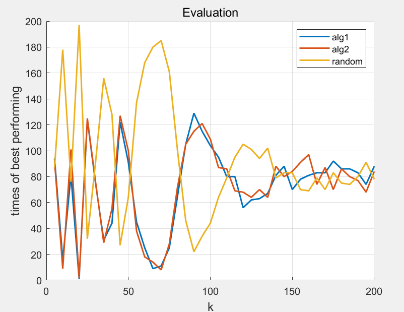

### 运行代码

+ 直接运行main.cpp即可，不需要参数,。
+ 若需要重定向输出，需要配置下以下路径

```C++
    freopen("../data.txt", "w", stdout);
```

+ MATLAB调用show.m可视化结果。

### 配置如下

+ site数目：1000
+ site坐标范围：(0,100000), double类型, 均为随机生成
+ k值变化范围[5,200], 步长为5
+ 对于每组实验重复200次，统计每个算法赢的册数

### 算法

1. 选择的起始节点到其他所有节点的距离之和最小
2. 选择的起始节点到其他所有节点的距离之和最大
3. 随机选择起始节点

#### 实验结果保存在了data.txt中，下面为可视化结果



### 结论

+ k较小的时候随机算法效果较好，k值100左右贪心算法要优于算法，总体上和随机算法效果接近。